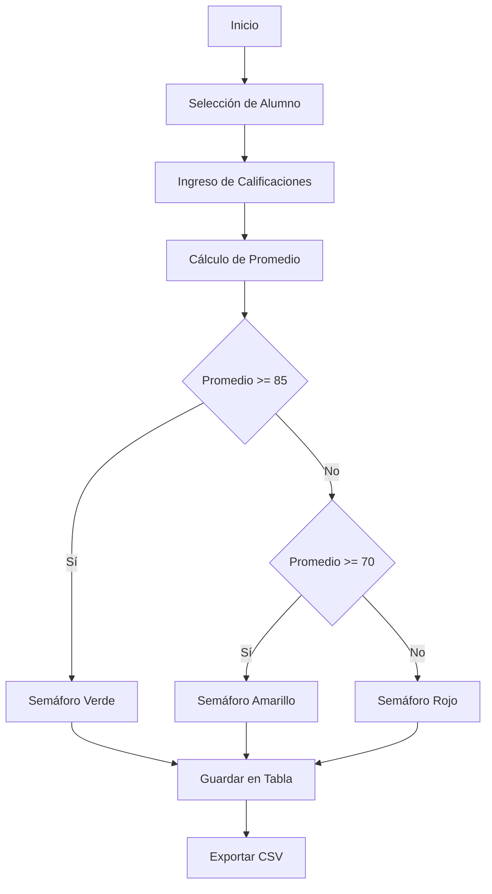

# Manual Técnico - Sistema de Boletas de Calificaciones

## 1. Portada
**Proyecto:** Sistema de Boletas de Calificaciones  
**Alumno:** Dulce María Valadez Molina  
**Grupo:** 3-B  
**Plantel:** CETis 50  
**Fecha:** Noviembre 2025

---

## 2. Descripción del Proyecto
Sistema web desarrollado para la gestión de calificaciones escolares, permitiendo el registro, cálculo y visualización de calificaciones por alumno. Implementa un sistema de semáforo para evaluación del desempeño y exportación de datos.

---

## 3. Herramientas Utilizadas
- **Python 3.13:** Lenguaje de programación principal  
- **Flet 0.21.0:** Framework para desarrollo de UI  
- **Vercel:** Plataforma de despliegue  
- **GitHub:** Control de versiones  
- **Visual Studio Code:** IDE de desarrollo

---

## 4. Diagrama de Flujo


---

## 5. Estructura de Archivos
```
boletas/
│
├── api/
│   └── index.py           # Código principal
├── requirements.txt       # Dependencias
└── vercel.json            # Configuración de despliegue
```

---

## 6. Funciones Principales

### Función Principal (`main`)
```python
def main(page: ft.Page):
    page.title = "BOLETAS DE CALIFICACIONES"
    page.bgcolor = "grey"
    # ...existing code...
```

### Cálculo de Promedio
```python
def calcular_promedio(e):
    notas = [
        int(esp.value or 0),
        int(mat.value or 0),
        # ...existing code...
    ]
    promedio = sum(notas) / len(notas)
```

### Exportación CSV
```python
def exportar_csv(e):
    with open('calificaciones.csv', mode='w', newline='', encoding='utf-8') as file:
        writer = csv.writer(file)
        # ...existing code...
```

---

## 7. Capturas del Código
> (Aquí deberías incluir capturas de las partes más relevantes del código)

---

## 8. Detalles de Despliegue

### Configuración de Vercel
```json
{
  "builds": [
    {
      "src": "api/index.py",
      "use": "@vercel/python"
    }
  ],
  "routes": [
    {
      "src": "/(.*)",
      "dest": "api/index.py"
    }
  ]
}
```

### Pasos de Despliegue
**Instalación de dependencias:**
```bash
pip install -r requirements.txt
```

**Configuración de Vercel:**
```bash
vercel login
vercel --prod
```

---

## 9. Bibliografía
- Documentación oficial de [Flet](https://flet.dev)
- [Python Documentation](https://docs.python.org/3/)
- [Vercel Documentation](https://vercel.com/docs)
- [GitHub Docs](https://docs.github.com/)

---

## 10. Requerimientos del Sistema
- Python 3.8+  
- Node.js 14+  
- Navegador web moderno  
- 512MB RAM mínimo  
- Conexión a Internet

---

## 11. Notas de Mantenimiento
- Actualizar dependencias periódicamente  
- Realizar respaldos de la base de datos  
- Monitorear el rendimiento en Vercel
